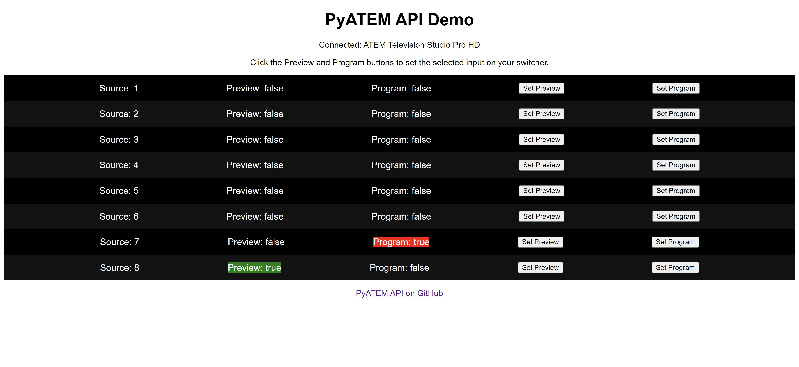

# PyATEMAPI

Python Blackmagic Design ATEM REST API

## Purpose

To provide a web API for interfacing with ATEM Switchers. The API is designed to be as simple as possible and to be as flexible as possible.

*Why build a web API for ATEM?*

This API allows developers to interact with ATEM Switchers without having to write desktop code. Instead, developers can now interact with
an ATEM through the browser using simple web APIs with Javascript.

## Roadmap / Features

-   [x] Fully Documented in [Postman](https://documenter.getpostman.com/view/19380446/UzQpvT1y)
-   [x] Web Example
-   [x] Get tally data
-   [x] Fade to black
-   [x] Trigger Cut
-   [x] Trigger auto transition
-   [x] Set preview
-   [x] Set program
-   [x] DSK Tie
-   [x] DSK Cut
-   [x] Ping switcher
-   [ ] Upload / manage media pool
-   [ ] Audio control
-   [x] Tested using ATEM Television Studio HD
-   [x] [Docker Image](https://hub.docker.com/repository/docker/mackenly/pyatemapi/general)
-   [ ] Support for options from env or config file
-   [ ] Support for multiple switchers
-   [ ] CI/CD Testing with GitHub Actions (will probably require creating or updating a more fully featured mocking tool like PyATEMSim but with better support)

## Usage

Clone PyATEMAPI to your machine by running:

```bash
git clone https://github.com/mackenly/PyATEMAPI.git
```

Enter the project's directory, then install the required packages by running:

```bash
pip install -r requirements.txt
```

While in the directory of the project, run ` python server.py` to start the server. Pass in as parameters the IP address `--ip` of the ATEM switcher, optionally a simple passphrase `--passphrase` for high level authentication, and optionally the port `--port` to run the server on (defaults to `5555`).

The passphrase is optional. If you do not include a passphrase, one will not be required. If you do use a passphrase, make sure to pass it in with your requests in the Authorization header (see below for an example).

The port is also optional. If you do not include a port, the server will run on port `5555`. If running via Docker, you can also map the port to a different port on the host machine using docker.


```bash
python server.py --ip 127.0.0.1 --passphrase Password1 --port 5555
```

> [!WARNING]
> Passing sensitive data in the command line will result in the passphrase being in plaintext in command line history logs such as in `.bash_history`, other Linux/Mac shell histories, or `$env:APPDATA\Microsoft\Windows\PowerShell\PSReadLine` in Windows. This probably doesn't matter for most users, but if you're concerned about it, you can use the following methods to pass in sensitive data:

<details>
<summary>Best practices for passing in sensitive variables</summary>

If running on native python, best practice is to read these variables in with the `read` command in Linux/Mac or the `Read-Host` command in Windows:

### Linux/Mac

```bash
read -s PASSPHRASE
read SERVER_IP
python3 server.py
```

### Windows

```powershell
$securedValue = Read-Host "Passphrase" -AsSecureString
$bstr = [System.Runtime.InteropServices.Marshal]::SecureStringToBSTR($securedValue)
$env:PASSPHRASE = [System.Runtime.InteropServices.Marshal]::PtrToStringAuto($bstr)
$env:SERVER_IP = Read-Host "Atem Device IP"
python server.py
```

NOTE: Some versions of powershell support `Read-Host "Password" -MaskInput` as well, which would reduce the above
command to simply:

```powershell
$env:PASSPHRASE = Read-Host "Passphrase" -MaskInput
$env:SERVER_IP = Read-Host "Atem Device IP"
python server.py
```
</details>

After starting the server, you can use the web API to interact with the ATEM Switcher.

## API Documentation

The API documentation is available through Postman at
[https://documenter.getpostman.com/view/19380446/UzQpvT1y](https://documenter.getpostman.com/view/19380446/UzQpvT1y).

## Demo

To demonstrate and test the API, a basic web controller example is provided. To run the example, enter the `web-example` directory, modify the constant at the top of `script.js` with the values you're using to run the server, and then open the `index.html` file in a browser.



## Example Request
To get the tally data from your ATEM switcher, you use Javascript, as shown below:

```javascript
fetch("http://localhost:5555/tally", {
  method: 'GET',
  headers: {
    'Authorization': 'MyPassword'
  },
})
  .then(response => response.text())
  .then(result => console.log(result))
  .catch(error => console.log('error', error));
```

The response should look something like this:
```json
[{'source': 1, 'preview': False, 'program': True}, {'source': 2, 'preview': False, 'program': False}, {'source': 3, 'preview': True, 'program': False}, {'source': 4, 'preview': False, 'program': False}, {'source': 5, 'preview': False, 'program': False}, {'source': 6, 'preview': False, 'program': False}, {'source': 7, 'preview': False, 'program': False}, {'source': 8, 'preview': False, 'program': False}]
```

Again, view [the API docs in Postman](https://documenter.getpostman.com/view/19380446/UzQpvT1y) for more examples and documentation.

## Docker

The application can be run via Docker. Use the DockerHub registered container found on [mackenly/pyatemapi](https://hub.docker.com/repository/docker/mackenly/pyatemapi/general) or build it yourself using the container definition. Some users run this locally on Synology NAS devices, which allow you to run Docker images, on a Raspberry Pi, or within a dedicated Docker server with other production automation apps.

### Create an ENV file

The ATEM device ip and passphrase for the API will be pulled from environment variables. To do this we'll need to create
and [env file](https://docs.docker.com/compose/environment-variables/env-file/) called `.env` which will be used by our
docker and docker-compose instructions later. Just create the `.env` file and edit it to have the following variables:

```plaintext
SERVER_IP=192.168.1.42
PASSPHRASE=MySecretPassword
```

### Run from DockerHub

You can run the application from the built images in DockerHub.

```bash
docker run -d -p 5555:5555 --env-file=.env mackenly/pyatemapi:latest
```

### Run with docker-compose

```bash
docker-compose up -d
```

You can also explicitly define the path to the env file if you are managing multiple configurations:

```bash
docker-compose --env-file .env_alt up -d
```

You can then bring the service down with a standard docker-compose down command:

```bash
docker-compose down
```

### Build and run Docker container from source

```bash
docker build -t pyatemapi .
docker run -d -p 5555:5555 --env-file=.env pyatemapi
```

## Testing

If you would like to test this API, you can use a tool called [PyATEMSim](https://github.com/jonknoll/pyAtemSim). In the directory of the simulator, simply run `python atem_server.py` and you will be able to interact with the simulated ATEM switcher's provided IP and port via this API. This simulator doesn't provide all the functionality of a real switcher and seems to have issues with input numbers, so don't rely on it for important testing.

## Contributing

Contributions are welcome. Please open an issue or pull request on [mackenly/PyATEMAPI](https://github.com/mackenly/PyATEMAPI).

Fiscal contributions can be made through [GitHub Sponsors](https://github.com/sponsors/mackenly).

## License

[The MIT License (MIT)](./LICENSE.md)
